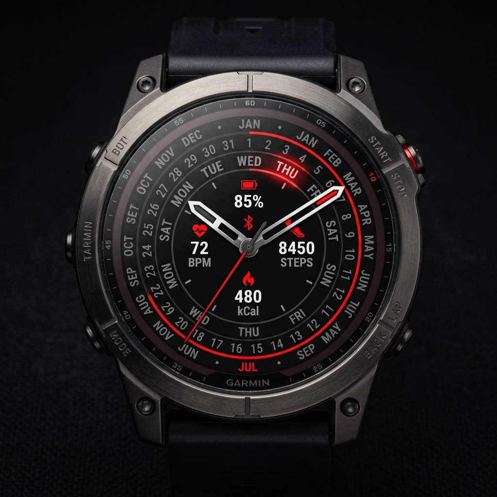
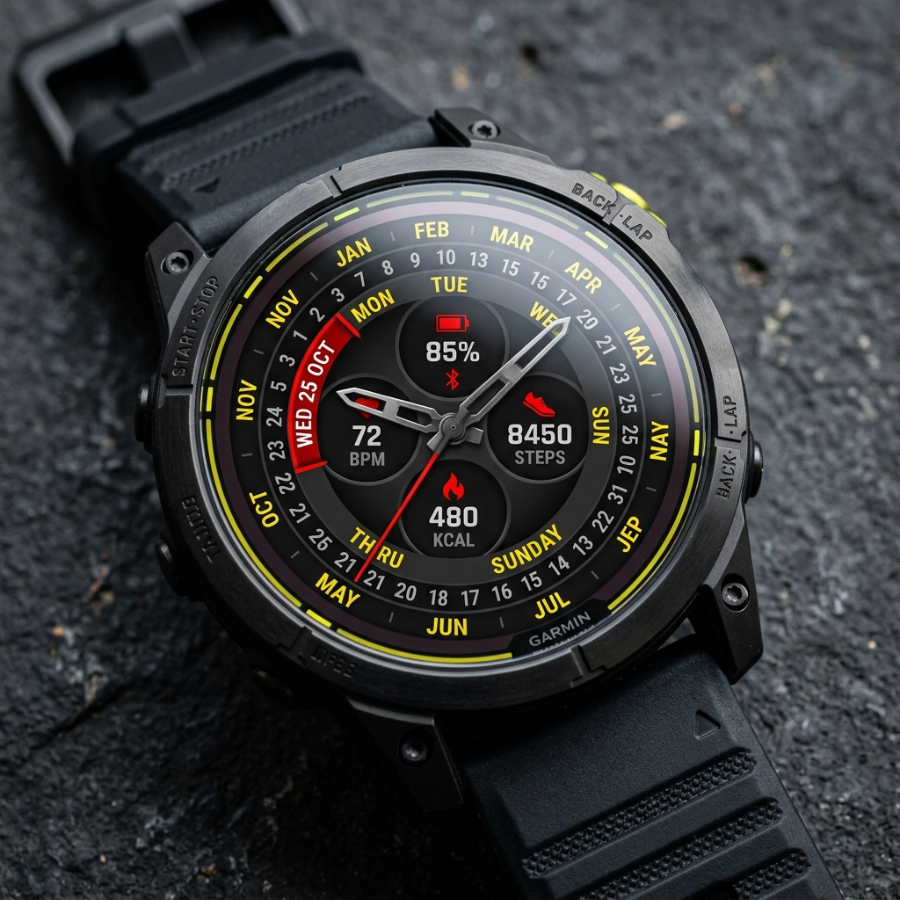

# Data Fields & Settings Documentation

This document outlines the 5-slot customizable data field engine for the Garmin Perpetual Calendar Watch Face.

---

## Visual Mockups

### Garmin Fenix 7


### Garmin Enduro 3


---

## Data Field Slot Positions

The watch face features 5 inner dial slots positioned inside the concentric calendar rings:

```text
               [ Slot 1: Top Center ]
  [ Slot 2: Mid-Left ]       [ Slot 4: Mid-Right ]
               [ Slot 3: Center Badge ]
             [ Slot 5: Bottom Center ]
```

---

## Out-of-the-Box Defaults

| Slot | Position | Default Metric | Format Example |
| :--- | :--- | :--- | :--- |
| **Slot 1** | Top Center | Battery Level | `85%` |
| **Slot 2** | Mid-Left | Heart Rate | `72 BPM` |
| **Slot 3** | Center Badge | Phone Connection / Notifications | `💬 3` |
| **Slot 4** | Mid-Right | Step Count | `8,450` |
| **Slot 5** | Bottom Center | Active Calories | `480 kcal` |

---

## Supported Selectable Metrics

Each slot can be individually reconfigured in the Garmin Connect IQ app settings to any of the following 14 metrics:

1. **None** (Hidden)
2. **Battery Level (%)**
3. **Heart Rate (BPM)**
4. **Step Count**
5. **Step Goal Progress (%)**
6. **Active Calories (kCal)**
7. **Distance Walked** (Km / Mi)
8. **Floors Climbed**
9. **Intensity Minutes**
10. **Stress Level**
11. **Digital Clock** (12h / 24h)
12. **Unread Notifications**
13. **Altitude / Elevation**
14. **Barometric Pressure**
