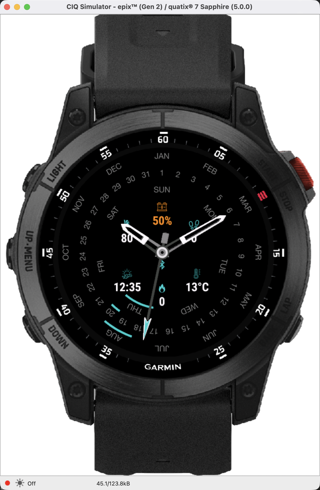
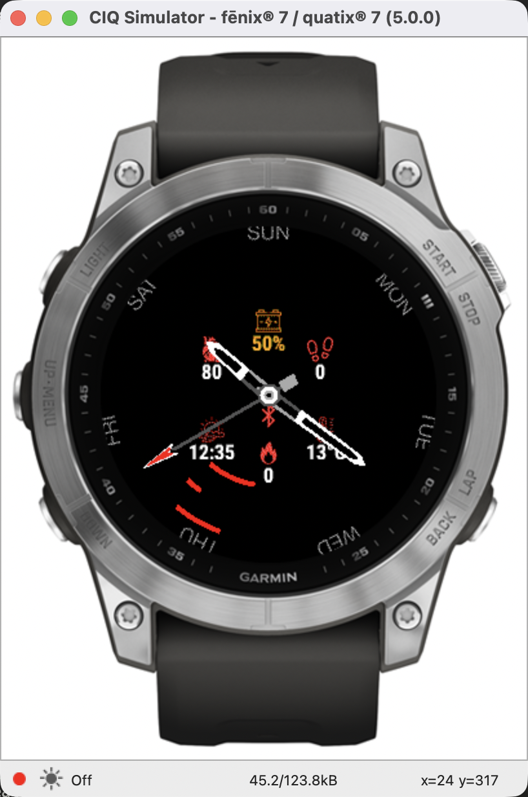
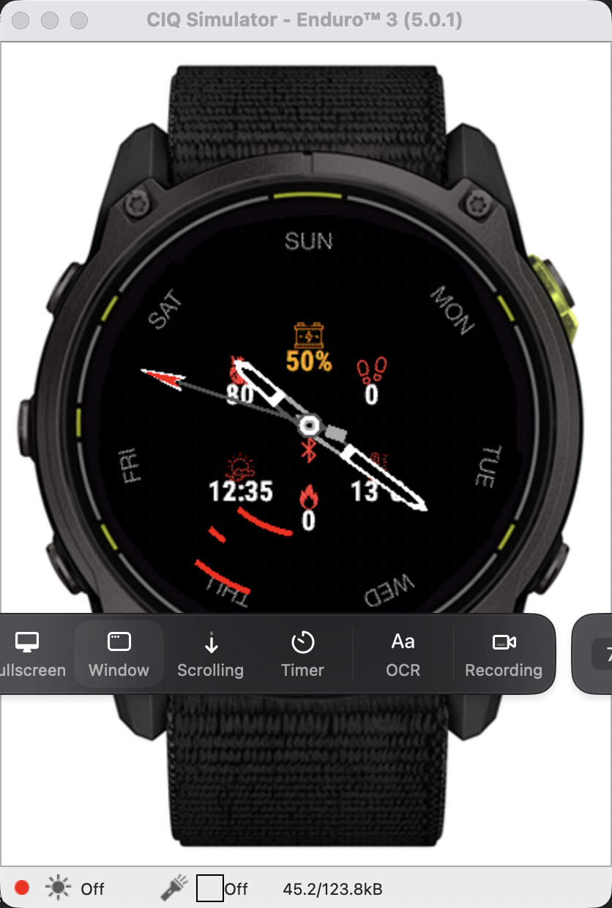
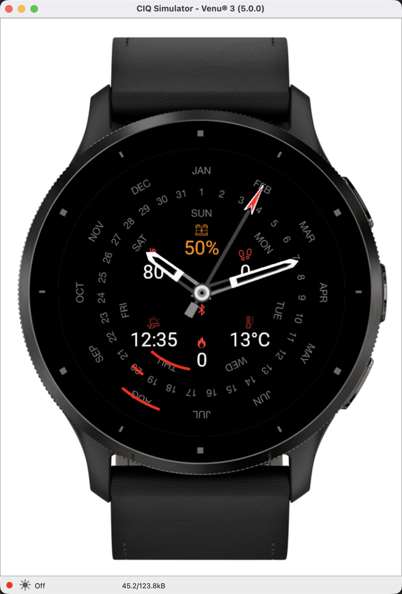
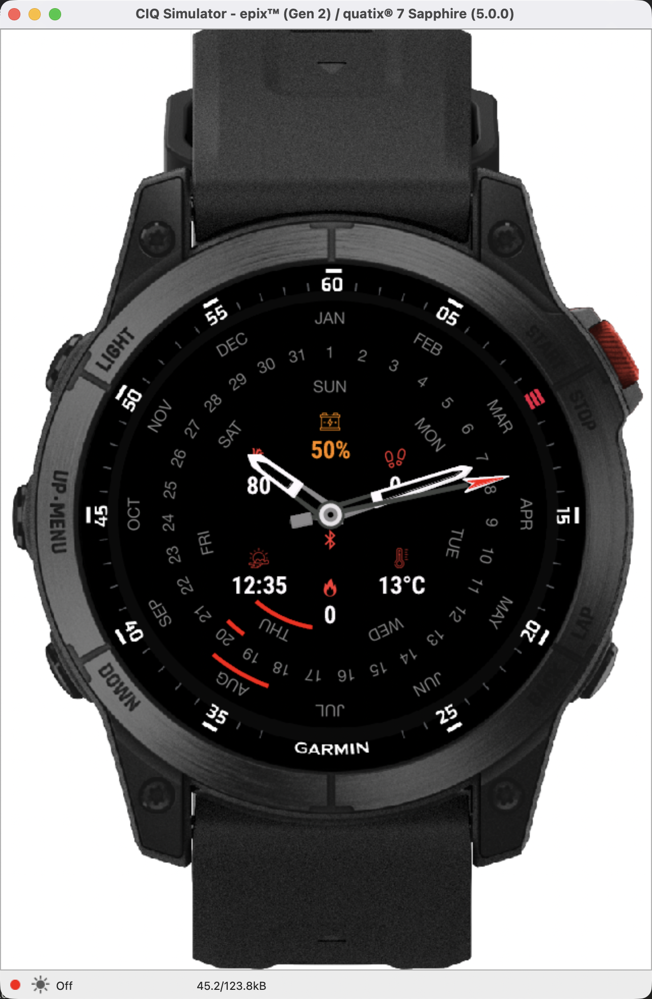
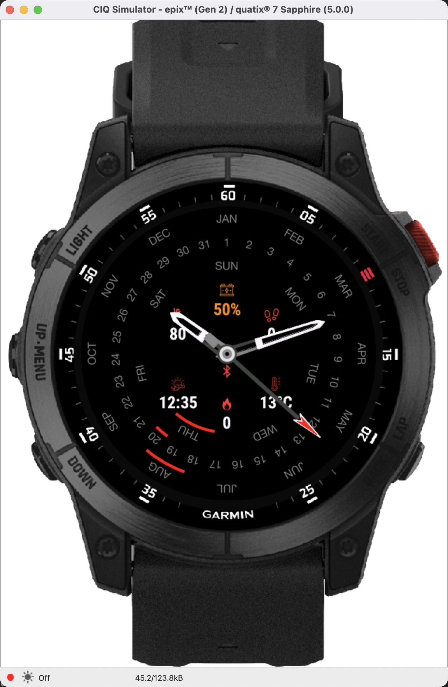
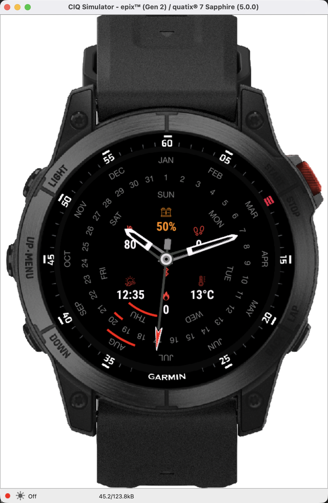
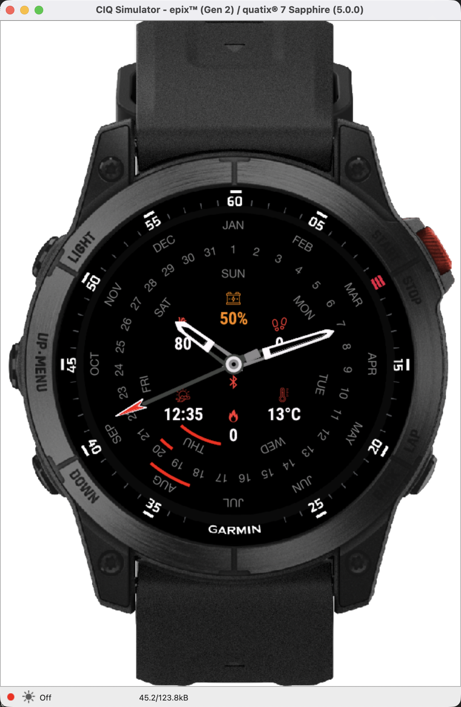

# ⌚ Perpex Tactical Perpetual Calendar — Garmin Connect IQ Store Release Guide

> **App Name**: Perpex Tactical Perpetual Calendar Watch Face  
> **Category**: Watch Face  
> **Target SDK**: Connect IQ SDK v9.2.0+  
> **Supported Devices**: 25+ Models (Fenix 7/7x/8, Enduro 3, Epix Gen 2/Pro, Venu 2/3, Forerunner 255/265/965)  

---

## 🌟 Store Listing Description

### Short Description (Tagline):
> High-performance tactical analog watch face featuring a mechanical perpetual calendar dial, 7 customizable data slots, low-power AMOLED AOD protection, and tactical Night Mode.

### Full Description:
**Perpex Tactical** combines old-world mechanical watchmaking elegance with modern Garmin data technology. Designed for outdoorsmen, tactical operators, and daily fitness enthusiasts, Perpex delivers instant situational awareness on MIP and AMOLED Garmin displays.

---

## 📸 Real App Store Screenshots (Multi-Device & Multi-Theme)

Here are official real-device simulator screenshots taken across supported watch resolution classes, color themes, night mode, and low-power AOD mode:

### 1. Vibrant Red Theme — Epix Gen 2 (416x416 AMOLED)


### 2. Teal & Cyan Theme — Fenix 7 (260x260 MIP)


### 3. Warm Orange Theme — Enduro 3 (280x280 MIP)


### 4. Electric Green Theme — Venu 3 (390x390 AMOLED)


### 5. Gold & Yellow Theme — Fenix 8 47mm (454x454 AMOLED)


### 6. Tactical Red Night Mode — Epix Gen 2


### 7. Stealth Green Night Mode — Epix Gen 2


### 8. Low-Power Always-On-Display (AOD) Mode — Epix Gen 2


---

## ⚙️ Key Features Highlighted in Screenshots:
* **Mechanical Perpetual Calendar Dial**: Dedicated concentric rings highlighting Day of Week, Month, and Day of Month in real time.
* **3D Heavy-Duty Industrial Hands**: Custom metallic hands with lume bevels, polished pivot hub, and high-contrast red second hand.
* **7 Customizable Data Fields**: Choose from 19 real-time metrics including Heart Rate (with live pulse animation), Weather Temperature (°C / °F), Body Battery, Solar Intensity, Dedicated Sunrise/Sunset times, Steps, Active Calories, Elevation, and Stress.
* **Tactical Night Mode**: Choose between Tactical Red (`0xFF0000`), Night Amber (`0xFF8800`), or Stealth Green (`0x00FF00`). Auto-triggers at sunset/sunrise, custom scheduled hours, or manually toggled.
* **AMOLED Burn-In Compliant Low-Power AOD**: Saves over 80% battery power with active pixel coverage under 5%. Hides second hand and heavy backgrounds while keeping stealth 3D hands and 7 data slots visible.
* **100% Settings Parity**: Customize every aspect directly from the **On-Watch Menu** or the **Garmin Connect IQ Mobile App**.

---

## 🛠️ Production Build & `.iq` Package Export Instructions

To build the production `.iq` file package for submission to the **Garmin Connect IQ Developer Store Portal**:

```bash
# Export production App Package (.iq file)
./export_iq.sh
```

- **Output Store Package**: `bin/PerpexTacticalWatchFace.iq` (Size: 3.0 MB)
- **Device Support**: Multi-device `.iq` bundle targeting 44 Garmin watch models.
