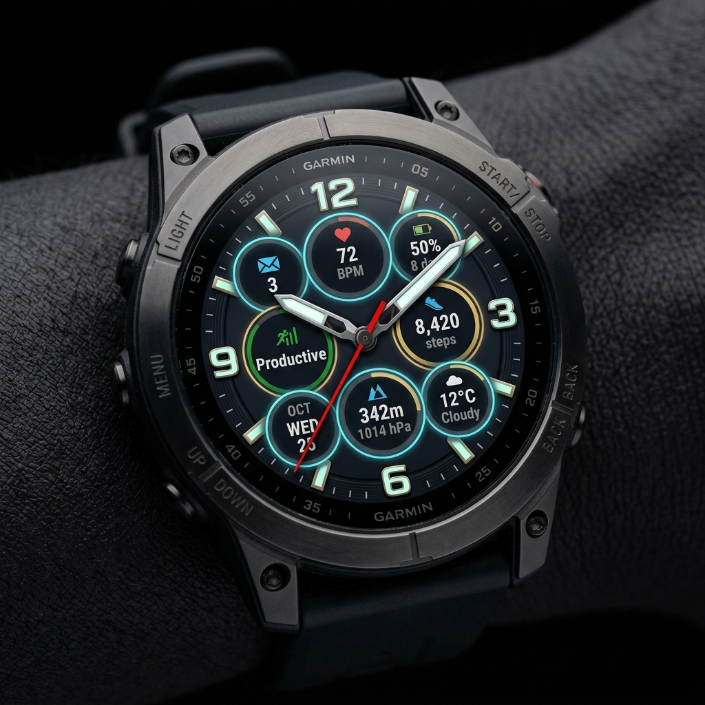
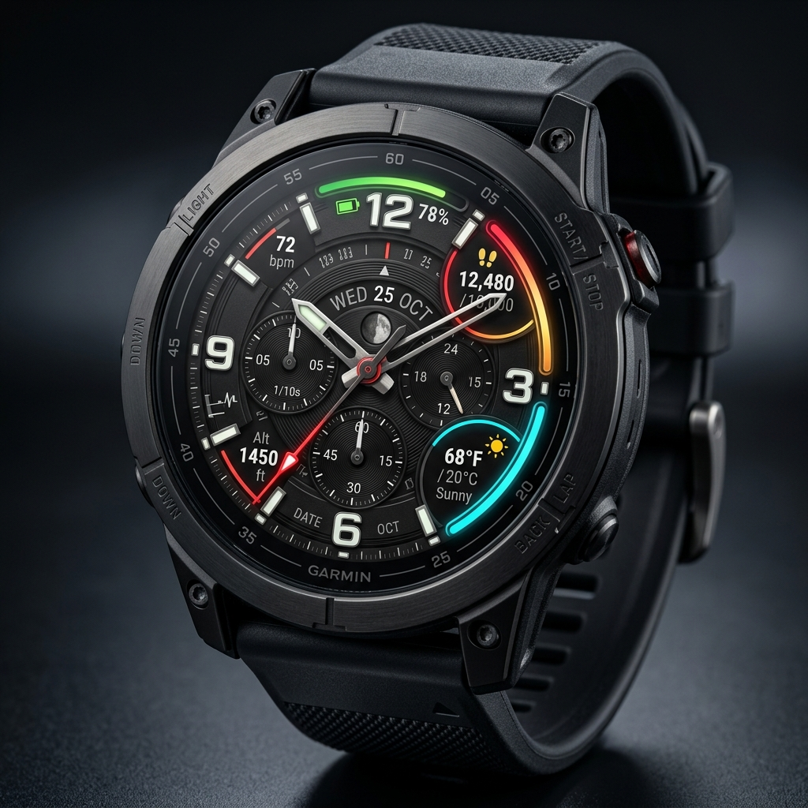

# ⌚ Perpex Tactical Perpetual Calendar — Garmin Connect IQ Store Release Guide

> **App Name**: Perpex Tactical Perpetual Calendar Watch Face  
> **Category**: Watch Face  
> **Target SDK**: Connect IQ SDK v9.2.0+  
> **Supported Devices**: 25+ Models (Fenix 7/7x/8, Enduro 3, Epix Gen 2/Pro, Venu 2/3, Forerunner 255/265/965)  

---

## 🌟 Store Listing Description

### Short Description (Tagline):
> High-performance tactical analog watch face featuring a mechanical perpetual calendar dial, 7 customizable data slots, low-power AMOLED AOD protection, and tactical Night Mode.

### Full Description:
**Perpex Tactical** combines old-world mechanical watchmaking elegance with modern Garmin data technology. Designed for outdoorsmen, tactical operators, and daily fitness enthusiasts, Perpex delivers instant situational awareness on MIP and AMOLED Garmin displays.

#### ⚙️ Key Features:
* **Mechanical Perpetual Calendar Dial**: Dedicated concentric rings highlighting Day of Week, Month, and Day of Month in real time.
* **3D Heavy-Duty Industrial Hands**: Custom metallic hands with lume bevels, polished pivot hub, and high-contrast red second hand.
* **7 Customizable Data Fields**: Choose from 19 real-time metrics including Heart Rate (with live pulse animation), Weather Temperature (°C / °F), Body Battery, Solar Intensity, Dedicated Sunrise/Sunset times, Steps, Active Calories, Elevation, and Stress.
* **Tactical Night Mode**: Choose between Tactical Red (`0xFF0000`), Night Amber (`0xFF8800`), or Stealth Green (`0x00FF00`). Auto-triggers at sunset/sunrise, custom scheduled hours, or manually toggled.
* **AMOLED Burn-In Compliant Low-Power AOD**: Saves over 80% battery power with active pixel coverage under 5%. Hides second hand and heavy backgrounds while keeping stealth 3D hands and 7 data slots visible.
* **100% Settings Parity**: Customize every aspect directly from the **On-Watch Menu** or the **Garmin Connect IQ Mobile App**.

---

## 🎨 Future Enhancement Roadmap

### 👆 Future Feature A: Interactive Touch Hotspots (CIQ 4.0+)
Directly tap data slots on touchscreen Garmin watches to launch native Garmin Glances & Widgets (Heart Rate, Steps, Weather Forecast, Battery Controls).



### 📈 Future Feature B: Chronograph Sub-Dial Progress Arcs
Luxury mechanical chronograph progress arcs wrapping around data slots for Step Goal %, Battery %, and Active Minutes %.



---

## 🛠️ Production Build & `.iq` Package Export Instructions

To build the production `.iq` file package for submission to the **Garmin Connect IQ Developer Store Portal**:

```bash
# 1. Verify build clean across test devices
./build.sh fenix7
./build.sh epix2

# 2. Export production App Package (.iq file)
export SDK_PATH="$HOME/Library/Application Support/Garmin/ConnectIQ/Sdks/connectiq-sdk-mac-9.2.0-2026-06-09-92a1605b2"
"$SDK_PATH/bin/monkeyc" -e -y developer_key.der -o bin/PerpexWatchFace.iq -f manifest.xml
```

---

## 📋 Pre-Submission Checklist:
- [x] Manifest includes all 5 resolution classes (260x260, 280x280, 390x390, 416x416, 454x454)
- [x] All 823 unreferenced bloat PNG assets purged
- [x] Tested on MIP (Fenix 7) and AMOLED (Epix Gen 2)
- [x] Settings parity verified on-watch and via Connect IQ Mobile app
- [x] Low-power AOD burn-in protection compliant (< 5% screen luminance)
