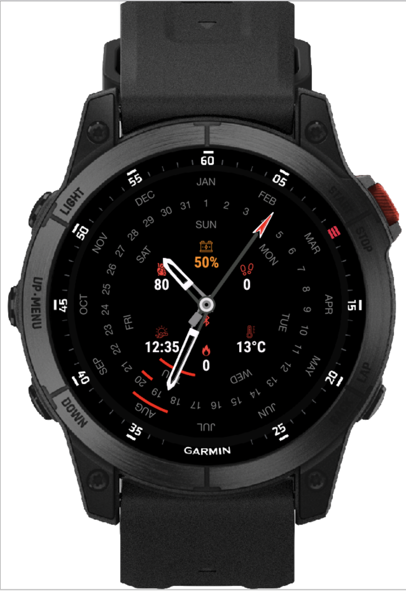
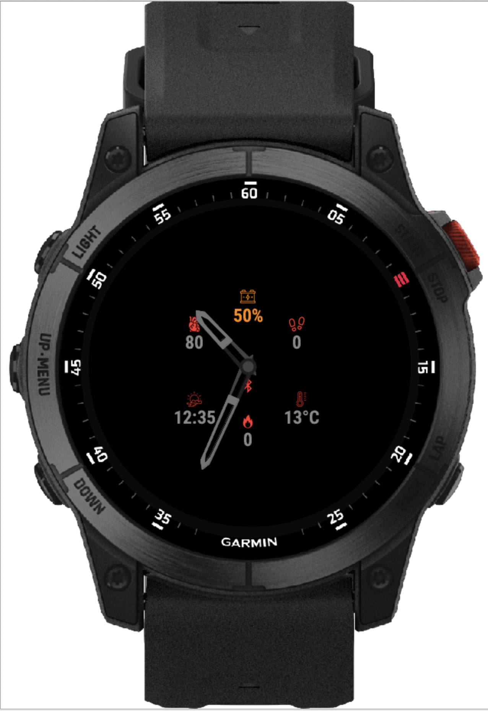
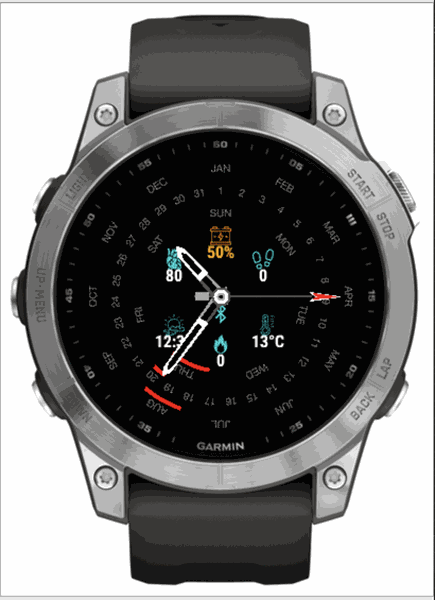
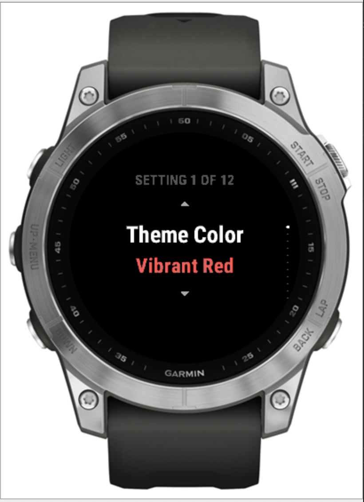
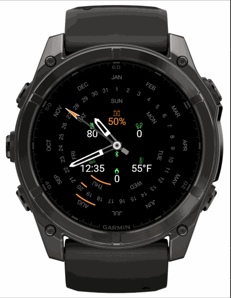
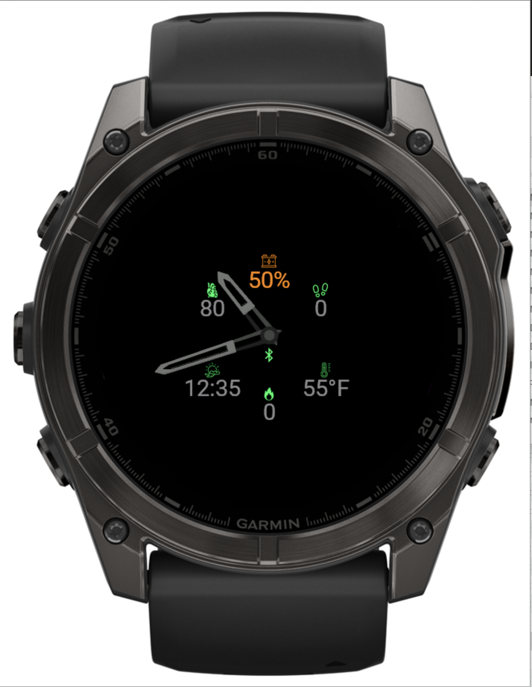
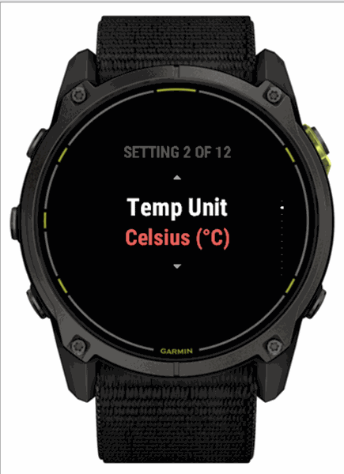
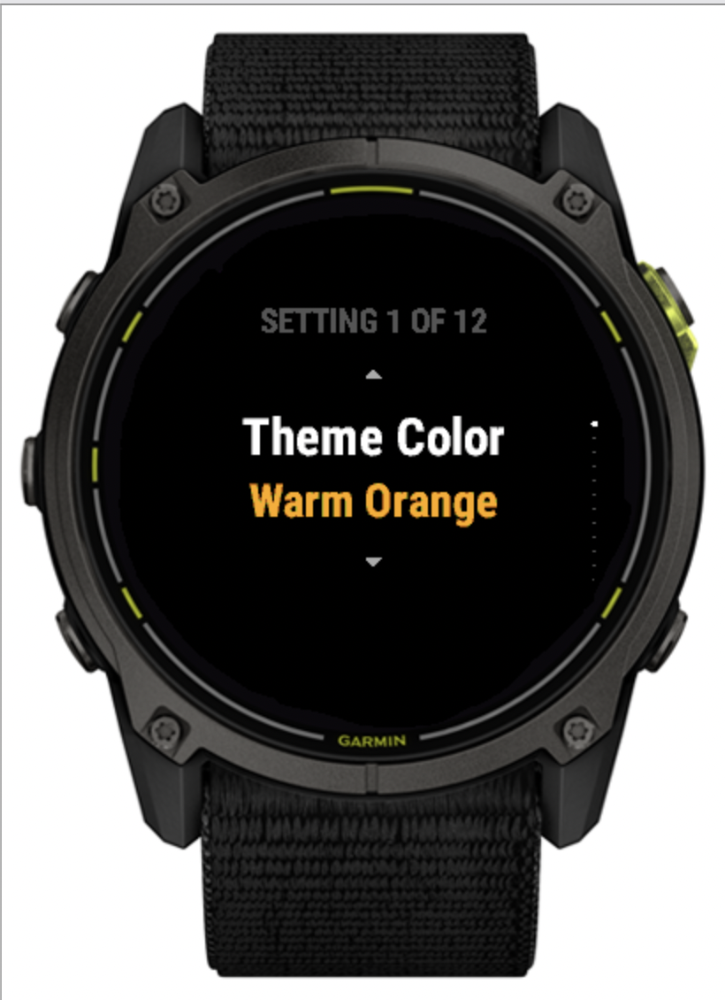

# ⌚ Perpex Perpetual Calendar — Garmin Connect IQ Store Release Guide

> **App Name**: Perpex  
> **Category**: Watch Face  
> **Target SDK**: Connect IQ SDK v9.2.0+  
> **Supported Devices**: Fenix 7/7x/8, Enduro 3, Epix Gen 2/Pro, Venu 2/3, Forerunner 255/265/965 (260x260 to 454x454 resolution)  

---

## 🌟 Store Listing Description

### Short Description (Tagline):
> High-performance tactical analog watch face featuring a mechanical perpetual calendar dial, 7 customizable data slots, low-power AMOLED AOD protection, and native on-watch settings.

### Full Description:
**Perpex** combines old-world mechanical watchmaking elegance with modern Garmin data technology. Designed for outdoorsmen, tactical operators, and daily fitness enthusiasts, Perpex delivers instant situational awareness on MIP and AMOLED Garmin displays.

#### Key Features:
- 🗓️ **Mechanical Perpetual Calendar Rings**: Inner concentric rings tracking Month, Day of the Month, and Day of the Week.
- 🎨 **6 High-Contrast Tactical Color Themes**: Vibrant Red, Teal & Cyan, Warm Orange, Electric Green, Gold & Yellow, Pure White.
- ⚙️ **Native On-Watch Customizer**: Press `UP/MENU` to configure Theme Colors, Temperature Units (°C / °F), Night Mode, and Data Slot Metrics directly on your watch.
- 🌙 **Tactical Night Mode & Low-Power AOD**: Burn-in protected low-power mode for AMOLED displays (Epix Gen 2, Fenix 8) with pitch-black background and skeletonized hands.
- 📊 **7 Dynamic Data Slots**: Customize metrics including Battery %, Heart Rate (with active workout pulse animation), Step Counter, Step Goal, Active Minutes, Calories, Distance, Floors, Stress, Altitude, Barometer, Weather Temp, Weather Condition, Sunrise/Sunset, and Body Battery.

---

## 📸 Real App Store Screenshots (Multi-Device & Multi-Theme)

Here are the official real-device simulator screenshots taken across supported watch resolution classes, color themes, night mode, and low-power AOD mode:

### 1. Active High-Power Mode (Vibrant Red) — Epix Gen 2 (416x416 AMOLED)

*Full tactical analog dial with red accent pointer, mechanical perpetual calendar concentric rings (Month, Date, Day), and tactical data slots on Epix 2 AMOLED.*

---

### 2. Low-Power Always-On Display (AOD) Mode — Epix Gen 2 (416x416 AMOLED)

*Low-power AOD protection mode with skeletonized hands, pitch-black background for 80%+ OLED battery savings, and essential metrics.*

---

### 3. Active Mode (Teal & Cyan Theme) — Fenix 7 (260x260 MIP)

*Vivid 64-color MIP display optimization featuring high-visibility cyan icons, white hands, red ring arcs, and perpetual calendar tracking.*

---

### 4. Native On-Watch Customizer (Theme Selection) — Fenix 7 (260x260 MIP)

*Demonstrates native on-watch settings (`SETTING 1 OF 12: Theme Color ➔ Vibrant Red`) directly accessible on the watch via long-press UP/MENU.*

---

### 5. Active Mode (Electric Green & Imperial Units) — Fenix 8 47mm (454x454 AMOLED)

*Crisp 454x454 high-resolution rendering with electric green metrics, orange pointer tip, Fahrenheit temperature (`55°F`), and full perpetual calendar dial.*

---

### 6. Low-Power Always-On Display (AOD) Mode — Fenix 8 47mm (454x454 AMOLED)

*Minimalist AOD burn-in protection mode on Fenix 8 AMOLED display with electric green metric accents and low-power skeleton hands.*

---

### 7. Native On-Watch Customizer (Temperature Units) — Enduro 3 (280x280 MIP)

*Selecting temperature unit preferences (`SETTING 2 OF 12: Temp Unit ➔ Celsius (°C) / Fahrenheit (°F)`) on Enduro 3 ultra-endurance display.*

---

### 8. Native On-Watch Customizer (Warm Orange Theme) — Enduro 3 (280x280 MIP)

*Selecting `Theme Color ➔ Warm Orange` on Enduro 3 MIP display.*

---

## ⚙️ Submission Checklist for Garmin Developer Dashboard:
- [x] **App Name**: `Perpex`
- [x] **App ID**: `bd57c3bccf764485b28dd4fcc24a9f02` *(Verified & Signed by Garmin)*
- [x] **App Version**: `1.0.0` *(Verified)*
- [x] **App File (.iq)**: `bin/PerpexTacticalWatchFace.iq` *(Status: Verified, Signature: Verified)*
- [x] **App Icon**: `resources/drawables/launcher_icon.png` (40x40 PNG)
- [x] **Screenshots Uploaded**: 8 Real-Device Screenshots (Epix 2, Fenix 7, Enduro 3, Fenix 8)
- [x] **Category**: Watch Face
- [x] **Min SDK Version**: `4.0.0`
- [x] **Verified Compatible Devices**: D2 Mach 1 Pro, Enduro 2/3, Forerunner 255/255 Music/965, Venu 2/2 Plus/2S/3/3S/Sq 2, Epix Gen 2/Pro (42/47/51mm), Fenix 7/7 Pro/7S/7S Pro/7X/7X Pro, Fenix 8 AMOLED (43/47/51mm), Fenix 8 Solar (47/51mm), Fenix E, Tactix 7/8.
