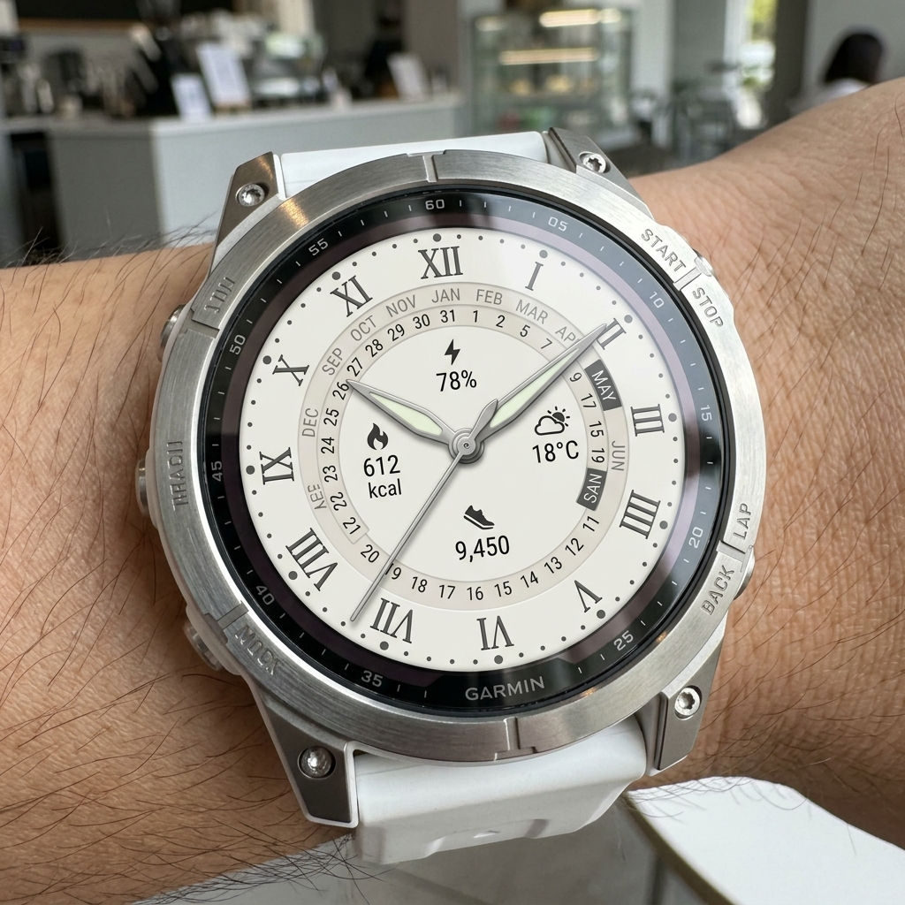
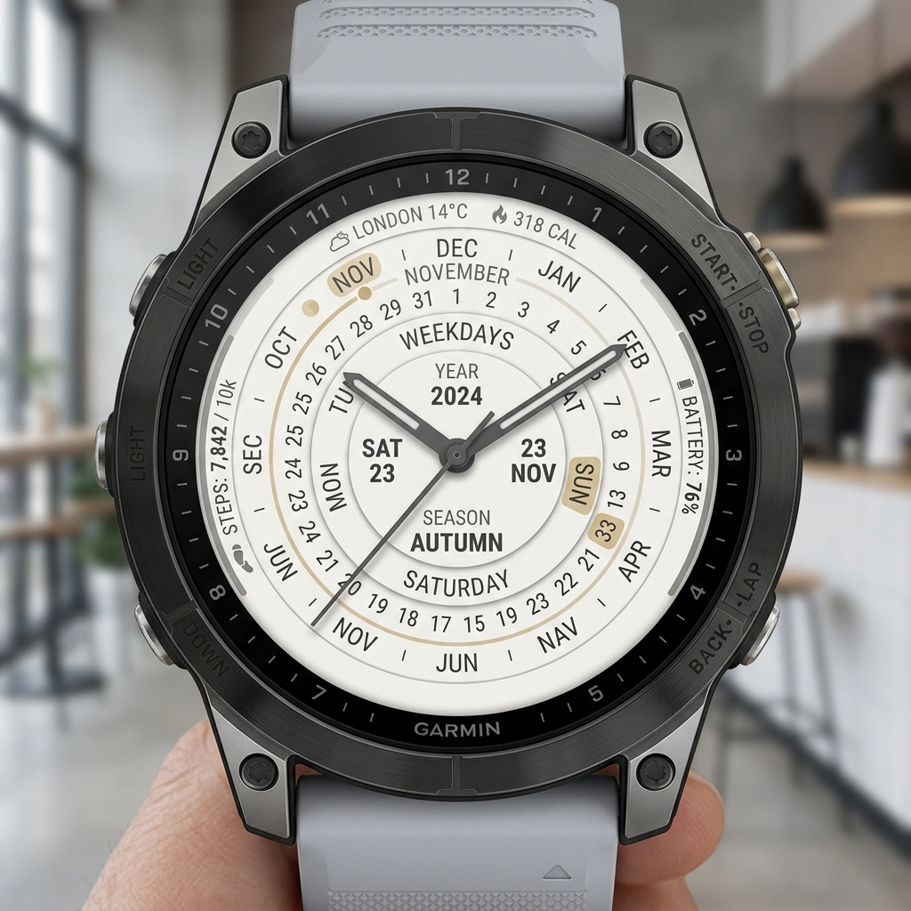
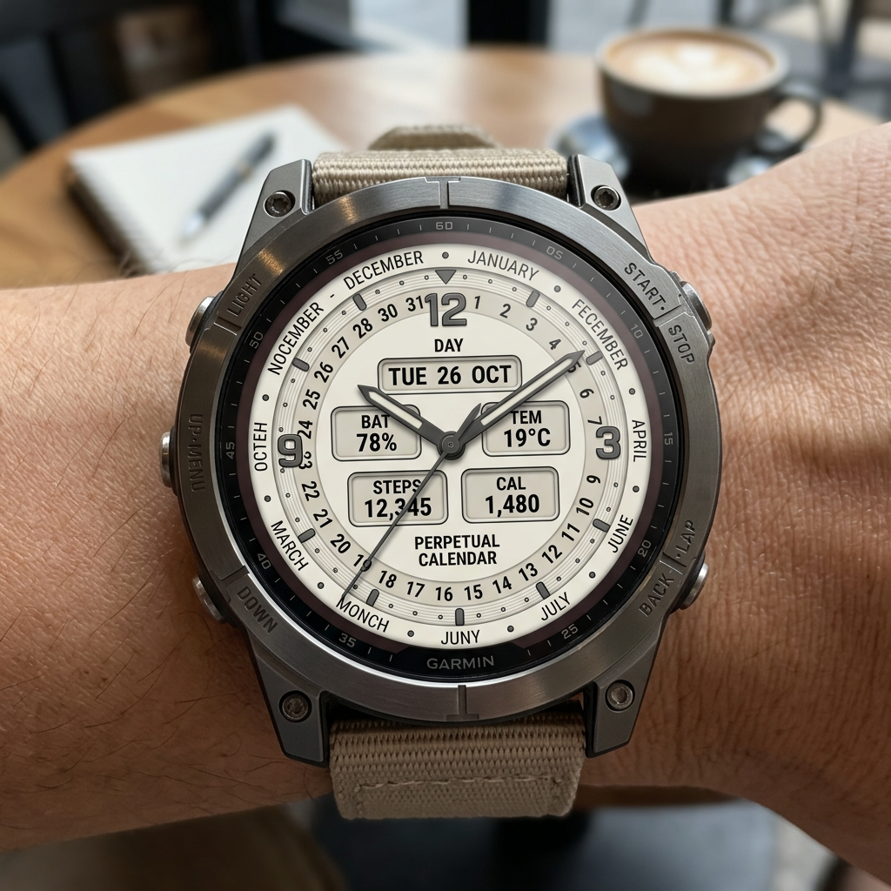

# Design Document: Option A (Refined Concentric Rings)

This document serves as the master record for the design of the **Option A** watch face layout. It features perfectly circular concentric rings for days, months, and days of the week, with the "Perpex" logo and accurate highlighting for the current date.

## Base Design

## Smart Complication Layout Options
To display the smart complications (Battery, Weather/Temperature, Step Counter, and Calories Burnt), we have generated three different layout options for you to review. We will make these selectable in the watch settings!

### Layout 1: Minimal Text & Icons
Tiny, elegant icons and text placed symmetrically at the 12, 3, 6, and 9 o'clock positions just inside the rings.

### Layout 2: Edge Progress Arcs
Thin progress arcs hugging the extreme outer edge of the bezel for the step counter and battery. Weather and calories are displayed as tiny minimalist text near the 12 o'clock position.

### Layout 3: Classic Digital Windows
Small, elegant rectangular digital complication windows (resembling classic mechanical date windows) integrated cleanly into the dial.

