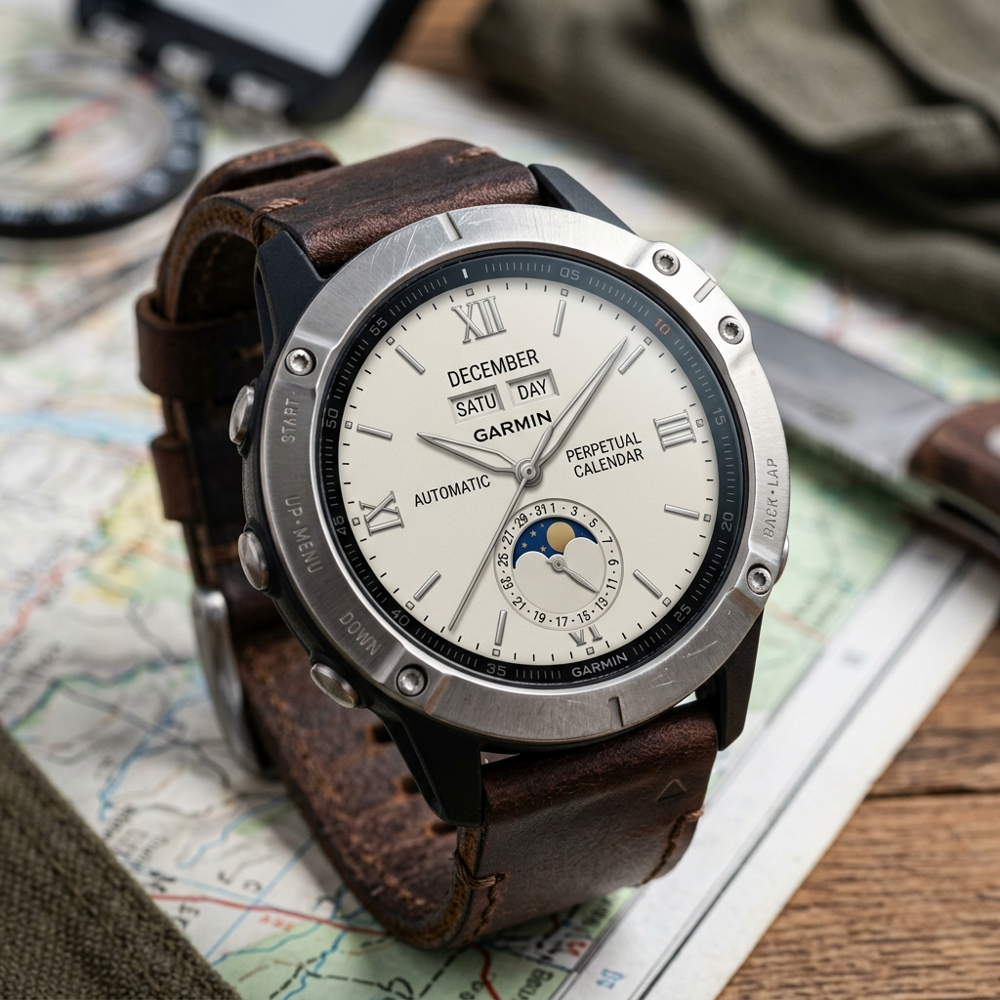

# Design Document: Option B (Classic Sub-dials)

This document serves as the master record for the design of the **Option B** watch face layout, which we will build in the future. It draws heavy inspiration from the Patek Philippe Grand Complications, using elegant sub-dials instead of concentric rings.

## Base Design

*Note: When we implement this, we will correct the text to feature the "Perpex" logo and ensure the month dial and information are appropriately cyclic and accurate for a smartwatch display.*
